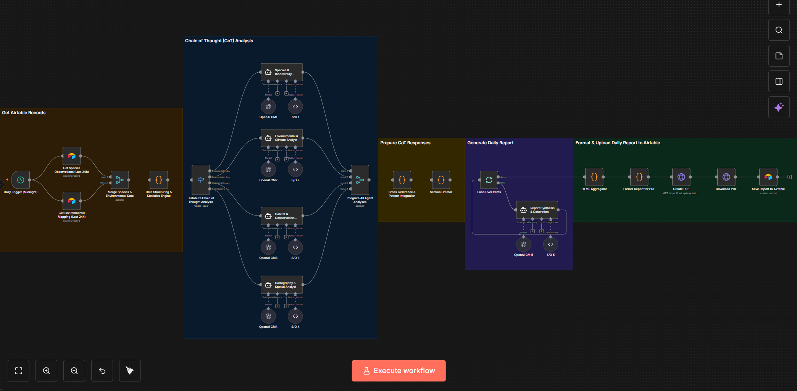

# Daily Reporter N8N Workflow
Automated generation of publication-quality environmental intelligence reports using 5 specialized AI agents powered by OpenAI GPT-4o.

## Overview
The Daily Reporter Workflow synthesizes species observation data from the past 24 hours into comprehensive PDF reports suitable for institutional audiences (NOAA, MBARI, conservation organizations). The workflow employs 5 specialized AI agents that analyze different domains, then integrates their findings into a cohesive narrative with professional formatting, embedded imagery, and FAIR data compliance.

---

## Workflow Architecture



**Figure 1: Daily Reporter N8N Workflow** - Automated environmental intelligence report generation using 5 specialized AI agents for species biodiversity analysis, environmental/climate assessment, habitat/conservation evaluation, cartography/spatial analysis, and report synthesis with professional PDF generation.

---

### Data Flow

```
Daily Trigger (Midnight UTC)
    ↓
Fetch Data from Airtable (Last 24h)
    ├─ Species Observations table
    └─ Environmental Mapping table
    ↓
Merge & Structure Data
    ↓
Data Statistics Engine
    ↓
Parallel AI Agent Analysis (4 agents)
    ├─ Agent 1: Species & Biodiversity Analyst
    ├─ Agent 2: Environmental & Climate Analyst
    ├─ Agent 3: Habitat & Conservation Analyst
    └─ Agent 4: Cartography & Spatial Analyst [VISION]
    ↓
Cross-Reference & Pattern Integration
    ↓
Agent 5: Report Synthesis & Generation
    ↓
Format Report for PDF (HTML generation)
    ↓
Generate PDF via PDFShift API
    ↓
Save to Airtable (Daily Reports table)
    ↓
Success Notification
```

---

## AI Agents

### Agent 1: Species & Biodiversity Analyst
**Purpose:** Comprehensive species-level analysis and biodiversity metrics

**Input:**

```json
{
  "speciesObservations": [...],  // All observations from last 24h
  "reportDate": "2025-11-27",
  "dailyStatistics": {
    "totalObservations": 247,
    "uniqueSpeciesCount": 34
  }
}
```

**AI Model:** OpenAI GPT-4o  
**Temperature:** 0.3 (factual, precise)  
**Max Tokens:** 16,000

**Analysis Performed:**
- Species diversity metrics (Shannon index, Simpson index)
- Taxonomic composition analysis
- Conservation status distribution
- Species rarity assessments
- Endemic species identification
- Ecological roles distribution
- Temporal activity patterns
- Comparative analysis (day-over-day trends)

**Output Structure:**

```json
{
  "speciesAnalyses": [
    {
      "speciesName": "Rufous-tailed Hummingbird",
      "scientificName": "Amazilia tzacatl",
      "observationCount": 18,
      "conservationStatus": "LC",
      "rarityScore": 0.23,
      "ecologicalRole": "Pollinator",
      "temporalPatterns": "Peak activity 0900-1500 local time",
      "significance": "Critical pollinator for native flora..."
    }
  ],
  "biodiversityMetrics": {
    "shannonIndex": 2.87,
    "simpsonIndex": 0.92,
    "speciesRichness": 34,
    "speciesEvenness": 0.78
  },
  "conservationSummary": {
    "endangeredSpecies": 3,
    "threatenedSpecies": 5,
    "leastConcern": 26
  }
}
```

**Key Insights Generated:**
- Which species are most/least common
- Conservation priorities
- Biodiversity health indicators
- Anomalies or rare sightings
- Ecological role distribution

---

### Agent 2: Environmental & Climate Analyst
**Purpose:** Environmental conditions and climate pattern analysis

**Input:**

```json
{
  "environmentalData": [...],  // All environmental records
  "marineObservations": [...],
  "terrestrialObservations": [...]
}
```

**AI Model:** OpenAI GPT-4o  
**Temperature:** 0.3  
**Max Tokens:** 12,000

**Analysis Performed:**
- Marine climate trends (SST, currents, wave height)
- Terrestrial climate trends (temperature, precipitation, humidity)
- Atmospheric conditions analysis
- Oceanographic patterns (for coastal observations)
- Soil conditions (for terrestrial observations)
- Environmental anomaly detection
- Seasonal pattern analysis

**Output Structure:**

```json
{
  "climateAnalysis": {
    "marine": {
      "avgSeaSurfaceTemp": 24.5,
      "tempRange": "22.1-26.8°C",
      "dominantCurrents": "Northward coastal current",
      "avgWaveHeight": 1.2,
      "anomalies": "Unusually warm SST (+2°C above seasonal average)"
    },
    "terrestrial": {
      "avgAirTemp": 28.3,
      "tempRange": "24.1-32.5°C",
      "totalPrecipitation": 45.2,
      "avgHumidity": 78,
      "anomalies": "Below-average rainfall for season"
    }
  },
  "environmentalTrends": {
    "temperatureTrend": "Increasing (+0.5°C vs. previous period)",
    "precipitationTrend": "Decreasing (-15% vs. previous period)",
    "overallAssessment": "Warmer and drier conditions persisting"
  }
}
```

**Key Insights Generated:**
- Environmental conditions summary
- Climate anomalies and their significance
- Potential impacts on observed species
- Seasonal context
- Environmental health indicators

---

### Agent 3: Habitat & Conservation Analyst
**Purpose:** Habitat assessment and conservation recommendations

**Input:**

```json
{
  "habitatData": [...],
  "conservationMetrics": [...],
  "speciesSummary": {...}  // From Agent 1
}
```

**AI Model:** OpenAI GPT-4o  
**Temperature:** 0.4 (allows for nuanced recommendations)  
**Max Tokens:** 14,000

**Analysis Performed:**
- Habitat type distribution
- Ecosystem health scores
- Conservation status analysis
- Threatened/endangered species observations
- Habitat degradation indicators
- Land use impacts
- Management recommendations
- Priority conservation areas

**Output Structure:**

```json
{
  "habitatAssessment": {
    "habitatTypes": {
      "tropicalRainforest": 142,
      "coastal": 58,
      "wetland": 32,
      "mangrove": 15
    },
    "ecosystemHealthScores": {
      "tropicalRainforest": 87,
      "coastal": 72,
      "wetland": 68,
      "mangrove": 81
    },
    "overallScore": 78
  },
  "conservationPriorities": [
    {
      "area": "Coastal zone (coordinates: 10.234, -84.567)",
      "priority": "High",
      "reasons": [
        "3 endangered species observed",
        "Habitat degradation indicators present",
        "Critical breeding habitat"
      ],
      "recommendations": [
        "Establish marine protected area",
        "Monitor water quality weekly",
        "Limit coastal development"
      ]
    }
  ],
  "degradationIndicators": {
    "habitatFragmentation": "Moderate",
    "pollutionLevels": "Low to Moderate",
    "invasiveSpecies": "None detected",
    "humanDisturbance": "Low"
  }
}
```

**Key Insights Generated:**
- Habitat quality assessment
- Conservation urgency levels
- Specific management recommendations
- Protected area priorities
- Restoration opportunities

---

### Agent 4: Cartography & Spatial Analyst [VISION]
**Purpose:** Spatial pattern analysis and satellite imagery interpretation using GPT-4 Vision

**Input:**

```json
{
  "satelliteImages": [...],  // Base64 encoded images (3 zoom levels per observation)
  "spatialData": [...],
  "coordinates": [...]
}
```

**AI Model:** OpenAI GPT-4o with Vision  
**Temperature:** 0.3  
**Max Tokens:** 20,000 (largest allocation for image analysis)

**Analysis Performed:**
- Satellite imagery interpretation (3 zoom levels: 10, 12, 14)
- Spatial distribution patterns
- Geographic clustering analysis
- Habitat connectivity assessment
- Bathymetric analysis (marine observations)
- Elevation patterns (terrestrial observations)
- Land use/cover interpretation
- Marine enhancement features (for coastal areas)

**Output Structure:**

```json
{
  "spatialAnalysis": {
    "geographicDistribution": {
      "clusterCount": 5,
      "clusters": [
        {
          "centroid": {"lat": 10.234, "lon": -84.567},
          "observationCount": 58,
          "radius": 2.3,
          "dominantHabitat": "Tropical rainforest",
          "description": "Dense observation cluster in lowland rainforest"
        }
      ],
      "dispersalPattern": "Clustered with some isolated observations",
      "hotspots": ["Northwestern coastal zone", "Central highland region"]
    },
    "imageryInterpretation": [
      {
        "observationId": "uuid-12345",
        "zoomLevel": 14,
        "interpretation": "Dense forest canopy with minimal clearings. High vegetation density (NDVI ~0.85). No visible degradation. Intact riparian buffer along stream visible on eastern edge.",
        "features": [
          "Continuous canopy cover",
          "Stream/river visible",
          "No roads or infrastructure",
          "Adjacent to cleared agricultural land (southern boundary)"
        ],
        "habitatQuality": "High - pristine forest conditions"
      }
    ]
  },
  "habitatConnectivity": {
    "overallConnectivity": "Moderate to High",
    "corridors": [
      "Riparian corridor connecting coastal to inland forests",
      "Continuous forest belt along elevation gradient"
    ],
    "fragmentationRisk": "Low in core areas, Moderate at edges"
  },
  "bathymetricFindings": {
    "depthRange": "0-45 meters",
    "underwaterFeatures": [
      "Coral reef structure at 15m depth",
      "Rocky substrate with kelp forest",
      "Sandy bottom areas"
    ]
  }
}
```

**Key Insights Generated:**
- Spatial patterns in species observations
- Habitat quality from satellite imagery
- Connectivity and fragmentation assessment
- Land use context
- Marine/terrestrial feature identification

**VISION Capability:** This agent is unique because it uses GPT-4 Vision to analyze satellite imagery directly. It can identify:
- Forest health from canopy structure
- Water quality from color/clarity
- Human impacts (roads, clearings, development)
- Habitat types and transitions
- Coastal features and marine zones

---

### Agent 5: Report Synthesis & Generation
**Purpose:** Integrate all agent analyses into cohesive narrative and generate publication-ready HTML

**Input:**
- Complete outputs from Agents 1-4
- Original structured data
- Cross-domain patterns

**AI Model:** OpenAI GPT-4o  
**Temperature:** 0.5 (allows creative narrative while maintaining accuracy)  
**Max Tokens:** 32,000 (LARGEST - generates complete report)

**Synthesis Tasks:**
- **Executive Summary:** High-level overview for decision-makers
- **Species-by-Species Analysis:** Detailed sections for each observed species (2-3 pages each)
- **Environmental Context:** Integrate climate and habitat findings
- **Geographic Distribution:** Synthesize spatial patterns
- **Cross-Domain Insights:** Identify relationships between domains
- **Conservation Recommendations:** Actionable management strategies
- **Data Quality Assessment:** Transparency about limitations
- **FAIR Compliance:** Document adherence to FAIR principles

**HTML Generation:** The agent generates complete HTML with:

**Color Scheme:**
- **Teal (#008B8B):** Primary headers, key metrics, branding
- **Ocean Blue (#1E90FF):** Section headers, accents
- **Forest Green (#228B22):** Conservation sections, FAIR badges
- **Off-white (#F5F5F5):** Background

**Typography:**
- **Headers:** Arial Bold (18-24pt)
- **Body:** Georgia (11pt) - journal standard
- **Tables:** Calibri (10pt)

**Report Sections:**

```
1. Cover Page
   - Audtheia branding
   - Report date
   - Gradient header in teal/blue

2. Executive Dashboard
   - 4 metric cards:
     * Total Observations
     * Unique Species
     * Conservation Priorities
     * Data Quality Score

3. Daily Overview
   - Key findings summary (500 words)
   - Significant observations
   - Notable patterns

4. Species Biodiversity Analysis
   - Agent 1 output (formatted)
   - Diversity metrics
   - Conservation status distribution
   - Individual species profiles

5. Environmental & Climate Assessment
   - Agent 2 output (formatted)
   - Climate trends
   - Environmental conditions
   - Anomalies and significance

6. Habitat & Conservation Status
   - Agent 3 output (formatted)
   - Habitat quality scores
   - Conservation priorities
   - Management recommendations

7. Cartography & Spatial Intelligence
   - Agent 4 output (formatted)
   - Spatial distribution maps
   - Satellite imagery interpretation
   - Connectivity assessment

8. Cross-Domain Insights
   - Integrated findings
   - Pattern recognition
   - Ecological relationships

9. Data Quality & FAIR Compliance
   - Completeness scores
   - Validation results
   - FAIR principles checklist:
     ✓ Findable: DOI, metadata
     ✓ Accessible: Open formats
     ✓ Interoperable: Standard schemas
     ✓ Reusable: Clear licensing

10. Research Recommendations
    - Suggested follow-up studies
    - Data gaps identified
    - Monitoring priorities

11. Methodology & Limitations
    - Data sources
    - AI agent descriptions
    - Known limitations

12. Professional Footer
    - Audtheia branding
    - Contact information
    - Citation information
```

**Output Structure:**

```json
{
  "htmlContent": "<html>...</html>",  // Complete HTML document
  "reportMetadata": {
    "reportDate": "2025-11-27",
    "generatedAt": "2025-11-27T00:15:32Z",
    "totalObservations": 247,
    "uniqueSpecies": 34,
    "wordCount": 8500,
    "pageCount": 28
  }
}
```

---

## Workflow Configuration

### 1. Import Workflow
1. Access N8N instance
2. Navigate to **Workflows** → **Import**
3. Upload `Daily_Reporter__GitHub_Template_.json`
4. Workflow appears in workflows list

### 2. Configure Credentials
**Settings → Credentials → Add Credential**

**OpenAI API:**
- Name: `OpenAI GPT-4o Reporter`
- API Key: Your OpenAI API key
- Used by: All 6 AI agents

**Airtable:**
- Name: `Airtable Audtheia`
- Personal Access Token: Your Airtable token
- Used by: Data fetch nodes, report save node

**PDFShift API (for PDF generation):**
- Name: `PDFShift`
- API Key: Your PDFShift API key (get free tier at https://pdfshift.io)
- Used by: PDF generation node

### 3. Configure Environment Variables
Set in N8N or `.env`:

```bash
# Airtable
AIRTABLE_BASE_ID=appXXXXXXXXXXXXXX
AIRTABLE_SPECIES_TABLE_ID=tblXXXXXXXXXXXXXX
AIRTABLE_MAPPING_TABLE_ID=tblXXXXXXXXXXXXXX
AIRTABLE_REPORTS_TABLE_ID=tblXXXXXXXXXXXXXX  # New table for daily reports

# PDF Generation
PDFSHIFT_API_KEY=your_pdfshift_key
```

### 4. Create Daily Reports Table in Airtable
**Table Name:** `Daily Reports`

**Columns:**
- Report Name (Single line text) - Primary
- Report Date (Date)
- PDF Attachment (Attachment)
- Species Count (Number)
- Total Observations (Number)
- Data Completeness (Number, 0-100)
- Processing Time (Date & time)
- Generated By (Single line text) - Default: "Audtheia AI Pipeline"

### 5. Set Up Schedule Trigger
1. Open workflow
2. Click **Daily Trigger (Midnight)** node
3. Configure schedule:
   - **Cron Expression:** `0 0 * * *` (midnight UTC)
   - Or use visual scheduler

### 6. Test Workflow
**Manual Test:**
1. Click **Execute Workflow** button
2. Monitor execution in **Executions** tab
3. Check for errors in each node
4. Verify PDF generated correctly
5. Confirm record created in Airtable

**Expected Execution Time:** 2-5 minutes (depends on data volume and image analysis)

### 7. Activate Workflow
1. Click **Active** toggle (top-right)
2. Workflow will run daily at midnight UTC
3. Monitor **Executions** for automated runs

---

## Data Flow

### Input Data Structure

**From Species Observations Table:**

```json
{
  "observationId": "uuid-12345",
  "speciesName": "Rufous-tailed Hummingbird",
  "scientificName": "Amazilia tzacatl",
  "timestamp": "2025-11-27T14:32:15Z",
  "latitude": 10.234,
  "longitude": -84.567,
  "iucnStatus": "LC",
  "rarityScore": 0.23,
  "habitatType": "Tropical rainforest",
  "temperature": 28.5,
  "elevation": 450
  // ... 62 total columns
}
```

**From Environmental Mapping Table:**

```json
{
  "observationId": "uuid-12345",
  "satelliteZoom10": "https://api.mapbox.com/...",
  "satelliteZoom12": "https://api.mapbox.com/...",
  "satelliteZoom14": "https://api.mapbox.com/...",
  "marineEnhancement": "{...JSON...}",
  "cartographicAnalysis": "Dense forest canopy..."
  // ... 10 total columns
}
```

### Intermediate Processing

**Data Structuring Engine** organizes data into:

```json
{
  "reportDate": "2025-11-27",
  "dailyStatistics": {
    "totalObservations": 247,
    "uniqueSpeciesCount": 34,
    "timeRange": "2025-11-26T00:00:00Z to 2025-11-27T00:00:00Z"
  },
  "speciesList": [...],
  "environmentalConditions": {...},
  "spatialData": {...},
  "dataQuality": {
    "completenessScore": 96,
    "validationFlags": []
  }
}
```

### Output: PDF Report

**File Format:** PDF (Letter size, 8.5" × 11")  
**File Size:** Typically 5-15 MB (with embedded images)  
**Page Count:** 20-40 pages (depends on species count)

**Delivered To:**
- Airtable Daily Reports table (PDF attachment)
- Optional: Email notification with download link
- Optional: Cloud storage (S3, Google Drive)

---

## Performance

### Execution Metrics:
- **Data Fetch:** 5-10 seconds (depends on record count)
- **Agent 1 (Species):** 30-45 seconds
- **Agent 2 (Climate):** 25-35 seconds
- **Agent 3 (Habitat):** 30-40 seconds
- **Agent 4 (Spatial/Vision):** 60-90 seconds (longest - image analysis)
- **Agent 5 (Synthesis):** 45-60 seconds (generates HTML)
- **PDF Generation:** 10-15 seconds
- **Airtable Write:** 3-5 seconds
- **Total:** 3-5 minutes

### Token Usage (per report):
- **Agent 1:** ~12,000 tokens
- **Agent 2:** ~10,000 tokens
- **Agent 3:** ~11,000 tokens
- **Agent 4:** ~18,000 tokens (includes image encoding)
- **Agent 5:** ~28,000 tokens
- **Total:** ~85,000 tokens per daily report

### Cost Estimate (OpenAI GPT-4o pricing):
- **Input tokens:** ~40,000 × $0.0025/1K = $0.10
- **Output tokens:** ~45,000 × $0.010/1K = $0.45
- **Total per report:** ~$0.55
- **Monthly cost (30 reports):** ~$16.50

---

## Error Handling

### Common Issues

**Issue: No observations in last 24h**  
**Solution:** Workflow detects empty dataset and sends notification instead of generating report

**Issue: Agent timeout**  
**Solution:**
- Increase timeout in N8N settings (default: 120s)
- Reduce `max_tokens` if needed
- Split large datasets into batches

**Issue: PDF generation fails**  
**Solution:**
- Verify PDFShift API key
- Check HTML validity
- Ensure images are properly Base64 encoded
- Try reducing image count/size

**Issue: Validation fails (Agent 6 returns FAIL)**  
**Solution:**
- Review validation output for specific errors
- Check data quality in Airtable
- Investigate agent outputs for contradictions
- Re-run RTSP Analyst if data quality < 70%

**Issue: Airtable write fails**  
**Solution:**
- Verify Daily Reports table exists
- Check column names match exactly
- Ensure Personal Access Token has write permissions
- Verify Base ID and Table ID correct

---

## Monitoring

### Key Metrics to Track
- **Execution Success Rate:** Target >95%
- **Average Processing Time:** Target <5 minutes
- **Data Completeness:** Target >85%
- **Report Word Count:** Typical 7,000-10,000 words
- **PDF File Size:** Typical 5-15 MB

### N8N Monitoring
1. Navigate to **Executions**
2. Filter by workflow: "Daily Reporter"
3. Review success/failure status
4. Check execution timeline
5. Investigate errors in failed nodes

### Quality Monitoring
Track in Airtable:
- Validation Status distribution over time
- Data Completeness trend
- Species Count per report
- Common warnings

---

## Customization

### Adjusting Agent Behavior

**Change Analysis Depth:** Edit system prompts in each agent node:
- **Temperature:** 0.3 (factual) → 0.5 (more interpretive)
- **Max Tokens:** 16,000 → 20,000 (more detailed)

**Modify Color Scheme:** Edit **Format Report for PDF** node:
```javascript
const tealColor = '#008B8B';  // Change to your brand color
const blueColor = '#1E90FF';
const greenColor = '#228B22';
```

**Add/Remove Report Sections:** Edit Agent 5 system prompt to include/exclude sections

### Adding New Agents
1. Create new AI Agent node
2. Configure GPT-4o model
3. Design system prompt
4. Add to parallel execution
5. Update integration node to include new agent output

### Changing Schedule

**Options:**
- **Hourly:** `0 * * * *`
- **Every 6 hours:** `0 */6 * * *`
- **Weekly (Mondays):** `0 0 * * 1`
- **Custom:** Use cron expression generator

---

## Troubleshooting

### Debug Mode
Enable detailed logging:
1. **N8N Settings** → **Workflows** → Enable **Debug Mode**
2. Re-run workflow
3. Check execution logs for detailed error messages

### Agent Output Inspection
To see what each agent produced:
1. Run workflow manually
2. Click on each agent node
3. View **Output** tab
4. Inspect JSON structure

### PDF Preview
Before full PDF generation:
1. Copy HTML from **Format Report for PDF** output
2. Save as `.html` file locally
3. Open in browser to preview
4. Adjust styling as needed

---

## Best Practices

### Data Quality
- Ensure RTSP Analyst workflow generates complete records
- Monitor data completeness scores
- Investigate validation warnings
- Review failed reports manually

### Report Quality
- Review first few generated reports manually
- Collect feedback from target audience
- Adjust agent prompts based on feedback
- Maintain consistent tone and formatting

### Performance Optimization
- Reduce image count if processing time too long
- Batch process if >100 observations per day
- Cache satellite imagery where possible
- Use lower resolution images for faster processing

### Security
- Never commit API keys to Git
- Use N8N credential vault
- Rotate API keys periodically
- Limit Airtable token permissions

---

## Integration with Other Workflows

### RTSP Analyst → Daily Reporter
Daily Reporter depends on RTSP Analyst:
- RTSP Analyst populates Species Observations table
- Daily Reporter reads from these tables
- Data quality in RTSP Analyst affects Daily Reporter quality

### Daily Reporter → Research Tools
Export data for analysis:
- Airtable → CSV export
- PDF → Research repository
- Data → Analysis platforms (R, Python, MATLAB)

---

## Support

**For Issues:**
- **GitHub Issues:** https://github.com/AudtheiaOfficial/audtheia-environmental-monitoring/issues
- Check N8N execution logs
- Review error messages in Airtable
- Inspect agent outputs for inconsistencies

**For Customization:**
- Modify agent system prompts
- Adjust HTML templates
- Change color schemes
- Add custom sections

---

This README provides complete documentation for the Daily Reporter workflow. For questions or customization assistance, please open a GitHub issue or refer to the main Audtheia documentation.
