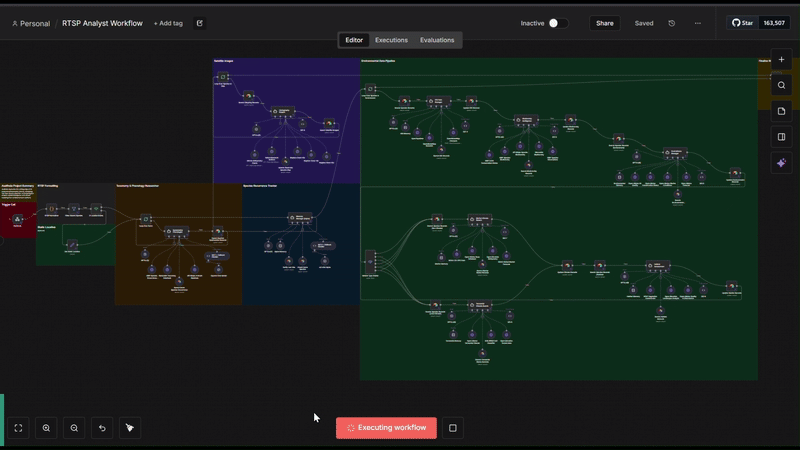
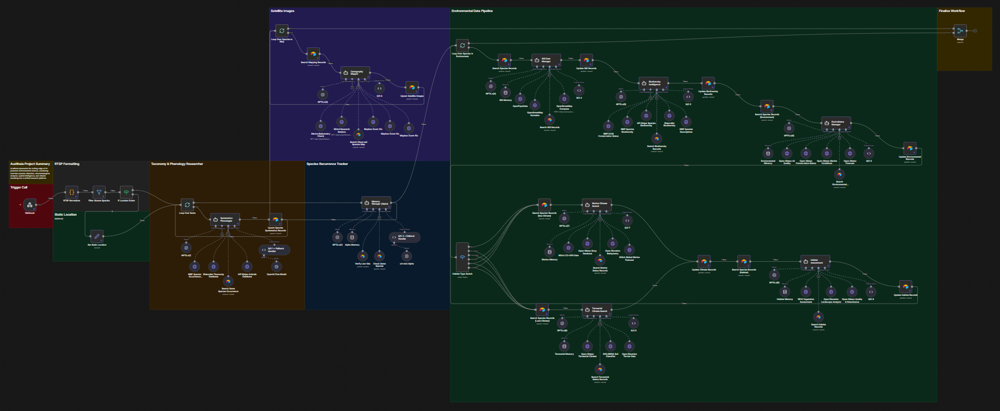

# RTSP Analyst Workflow
Deep AI-powered ecological analysis using 9 specialized agents to generate 72 comprehensive data points per species observation.

## Overview
The RTSP Analyst Workflow receives detection data from the Roboflow RTSP Workflow and performs comprehensive environmental analysis using 9 specialized AI agents powered by OpenAI GPT-4o. Each agent focuses on a specific domain (taxonomy, geography, biodiversity, climate, habitat, cartography) and integrates with scientific databases to produce research-grade ecological datasets.

<div align="center">
  
  <p><em>Deep AI analysis pipeline: 9 specialized AI agents processing species detections to generate 72 comprehensive data points per observation, integrating GBIF, iNaturalist, IUCN, NOAA, Mapbox, and climate databases</em></p>
</div>

---

## Workflow Architecture



**Figure 1: RTSP Analyst N8N Workflow** - Comprehensive ecological analysis system with 9 specialized AI agents (Systematics Phenologist, Memory Manager, GIS Data Manager, Biodiversity Intelligence, EnviroStatus Manager, Marine Climate Search, Terrestrial Climate Search, Habitat Assessment, Cartography Mapper) generating 72 data points per observation with integration to 12+ scientific databases.

---

### Data Flow

```
Webhook Trigger (Detection Data)
    ↓
Parallel Agent Execution (9 agents)
    ├─ Agent 1: Systematics Phenologist
    ├─ Agent 2: Memory Manager
    ├─ Agent 3: GIS Data Manager
    ├─ Agent 4: Biodiversity Intelligence
    ├─ Agent 5: EnviroStatus Manager
    ├─ Agent 6: Marine Climate Search
    ├─ Agent 7: Terrestrial Climate Search
    ├─ Agent 8: Habitat Assessment
    └─ Agent 9: Cartography Mapper
    ↓
Data Aggregation (72 data points)
    ↓
Airtable Write (2 tables)
    ↓
Webhook Response
```

---

## AI Agents

### Agent 1: Systematics Phenologist
**Purpose:** Taxonomic classification and phenological analysis

**Input:**

```json
{
  "species_name": "Rufous-tailed Hummingbird",
  "timestamp": "2025-11-27T14:32:15Z",
  "location": {"lat": 10.234, "lon": -84.567}
}
```

**Data Sources:**
- GBIF (Global Biodiversity Information Facility)
- iNaturalist

**Output (15 data points):**
- Taxonomic classification (Kingdom → Species)
- Common name and scientific name
- GBIF usage key
- Phenological stage (breeding, migration, etc.)
- Breeding season match (boolean)
- Migration route overlap (boolean)
- Temporal activity patterns
- Age class
- Reproductive status

**Analysis Process:**
1. Query GBIF for taxonomic match
2. Validate scientific classification
3. Retrieve occurrence data
4. Analyze temporal patterns
5. Determine phenological stage
6. Check breeding season alignment

---

### Agent 2: Memory Manager
**Purpose:** Spatiotemporal context and pattern recognition

**Input:**
- Historical observations from Airtable

**Data Sources:**
- Airtable (Species Observations table)

**Output (5 data points):**
- Spatiotemporal context (text)
- Pattern recognition (text)
- Anomaly detection (text)
- Observation history summary
- Trend analysis

**Analysis Process:**
1. Query Airtable for past observations in area
2. Analyze temporal patterns (seasonal, daily)
3. Identify spatial patterns (clustering, migration)
4. Detect anomalies (unusual species, times, locations)
5. Generate contextual summary
6. Provide trend analysis

**Example Output:**

```
Spatiotemporal Context:
"This Rufous-tailed Hummingbird observation is the 18th recorded
in this tropical rainforest location over the past 30 days. The
species shows consistent diurnal activity patterns with peak
observations between 0900-1500 local time."

Pattern Recognition:
"Observations cluster within 500m radius, suggesting established
territory. Frequency aligns with known breeding season (March-July)
in this biogeographic region."

Anomaly Detection:
"No significant anomalies detected. Observation consistent with
historical patterns for species and location."
```

---

### Agent 3: GIS Data Manager
**Purpose:** Geographic validation and spatial context

**Input:**

```json
{
  "latitude": 10.234,
  "longitude": -84.567,
  "species_name": "Rufous-tailed Hummingbird"
}
```

**Data Sources:**
- OpenStreetMap Nominatim
- OpenTopoData
- Open Elevation

**Output (8 data points):**
- Validated coordinates
- Location (city/town name)
- Region/state
- Country
- Geographic zone (tropical, temperate, etc.)
- Elevation (meters)
- Depth (meters, for marine)
- Biogeographic region

**Analysis Process:**
1. Validate coordinate format
2. Reverse geocode to location names
3. Retrieve elevation data
4. Determine geographic zone
5. Identify biogeographic region
6. Calculate depth (if marine coordinates)

---

### Agent 4: Biodiversity Intelligence
**Purpose:** Conservation status and biodiversity metrics

**Input:**

```json
{
  "species_name": "Rufous-tailed Hummingbird",
  "scientific_name": "Amazilia tzacatl",
  "location": {"lat": 10.234, "lon": -84.567}
}
```

**Data Sources:**
- IUCN Red List
- GBIF
- iNaturalist
- API Ninjas

**Output (9 data points):**
- IUCN conservation status (LC, NT, VU, EN, CR, EW, EX)
- GBIF occurrence count
- Species rarity score (0.0-1.0)
- Species rarity reason/justification
- Endemic species (boolean)
- Ecological role (pollinator, predator, etc.)
- Trophic level
- Functional group
- Threat assessment

**Analysis Process:**
1. Query IUCN Red List for conservation status
2. Retrieve GBIF occurrence count
3. Calculate rarity score based on occurrence data
4. Determine endemic status for location
5. Identify ecological role
6. Assess conservation threats

**Rarity Score Calculation:**

```
Rarity Score = 1 - (log(occurrence_count + 1) / log(max_occurrence + 1))

Where:
- occurrence_count: GBIF occurrences for species
- max_occurrence: Maximum occurrences in database

Result: 0.0 (common) to 1.0 (extremely rare)
```

---

### Agent 5: EnviroStatus Manager
**Purpose:** Habitat assessment and ecosystem classification

**Input:**

```json
{
  "species_name": "Rufous-tailed Hummingbird",
  "location": {"lat": 10.234, "lon": -84.567},
  "elevation": 450
}
```

**Data Sources:**
- API Ninjas (species characteristics)
- Open-Meteo (current conditions)

**Output (6 data points):**
- Habitat type (rainforest, wetland, etc.)
- Ecosystem classification
- Environmental suitability score (0-100)
- Habitat quality assessment
- Disturbance indicators
- Land use context

**Analysis Process:**
1. Retrieve species habitat preferences
2. Analyze current environmental conditions
3. Determine ecosystem type
4. Calculate habitat suitability
5. Assess habitat quality
6. Identify disturbance factors

---

### Agent 6: Marine Climate Search
**Purpose:** Marine environmental data analysis (activated for coastal/marine observations)

**Input:**

```json
{
  "location": {"lat": 36.789, "lon": -121.234},
  "habitat_type": "coastal",
  "timestamp": "2025-11-27T14:32:15Z"
}
```

**Data Sources:**
- NOAA Co-OPS (Tides and Currents)
- Open-Meteo Marine API

**Output (8 data points, marine only):**
- Marine zone (neritic, oceanic, intertidal, etc.)
- Sea surface temperature (°C)
- Ocean currents (direction + speed)
- Wave height (meters)
- Salinity (PSU)
- Bathymetry (meters)
- Tide stage
- Upwelling index

**Analysis Process:**
1. Identify nearest NOAA station
2. Retrieve real-time marine data
3. Query Open-Meteo for ocean conditions
4. Determine marine zone classification
5. Retrieve bathymetric data
6. Analyze oceanographic patterns

---

### Agent 7: Terrestrial Climate Search
**Purpose:** Terrestrial climate and soil data (activated for land-based observations)

**Input:**

```json
{
  "location": {"lat": 10.234, "lon": -84.567},
  "habitat_type": "tropical_rainforest",
  "timestamp": "2025-11-27T14:32:15Z"
}
```

**Data Sources:**
- Open-Meteo Weather API
- SOILGRIDS

**Output (8 data points, terrestrial only):**
- Biome classification
- Air temperature (°C)
- Soil temperature (°C)
- Precipitation (mm)
- Humidity (%)
- Atmospheric pressure (hPa)
- Soil type
- Soil pH

**Analysis Process:**
1. Query Open-Meteo for current weather
2. Retrieve SOILGRIDS soil data
3. Determine biome classification
4. Analyze climate patterns
5. Assess precipitation trends
6. Evaluate soil characteristics

---

### Agent 8: Habitat Assessment
**Purpose:** Ecosystem health and vegetation analysis

**Input:**

```json
{
  "location": {"lat": 10.234, "lon": -84.567},
  "habitat_type": "tropical_rainforest",
  "environmental_data": {...}
}
```

**Data Sources:**
- NDVI (Normalized Difference Vegetation Index)
- Land Cover APIs
- Open-Meteo

**Output (7 data points):**
- Vegetation density (NDVI score)
- Land cover type
- Substrate type
- Ecosystem health score (0-100)
- Habitat degradation indicators
- Water quality index (if aquatic)
- Pollution level (Low, Moderate, High)

**Analysis Process:**
1. Calculate NDVI for location
2. Retrieve land cover classification
3. Determine substrate type
4. Assess ecosystem health
5. Identify degradation indicators
6. Evaluate water quality (if applicable)

**Ecosystem Health Score Calculation:**

```
Health Score = weighted_average([
  NDVI_score * 0.3,
  vegetation_cover * 0.2,
  water_quality * 0.2,
  pollution_inverse * 0.15,
  biodiversity_index * 0.15
])

Result: 0 (degraded) to 100 (pristine)
```

---

### Agent 9: Cartography Mapper
**Purpose:** Satellite imagery generation and spatial analysis

**Input:**

```json
{
  "location": {"lat": 10.234, "lon": -84.567},
  "habitat_type": "coastal"
}
```

**Data Sources:**
- Mapbox Static Images API
- NOAA (for marine enhancements)
- OpenStreetMap

**Output (10 data points):**
- Satellite imagery URL (zoom 10)
- Satellite imagery URL (zoom 12)
- Satellite imagery URL (zoom 14)
- Marine enhancement data (JSON, if coastal)
- NOAA station data (JSON, if coastal)
- Bathymetric chart data (JSON, if marine)
- Cartographic analysis (text)
- Spatial context (text)
- Surrounding land use
- Habitat connectivity assessment

**Analysis Process:**
1. Generate Mapbox satellite imagery (3 zoom levels)
2. If coastal: Query NOAA for marine enhancements
3. If marine: Retrieve bathymetric data
4. Analyze spatial context
5. Assess habitat connectivity
6. Evaluate surrounding land use

**Mapbox URL Format:**

```
https://api.mapbox.com/styles/v1/mapbox/satellite-v9/static/
{lon},{lat},{zoom},0/{width}x{height}?access_token={token}

Example:
https://api.mapbox.com/styles/v1/mapbox/satellite-v9/static/
-84.567,10.234,10,0/600x400?access_token=pk.eyJ1...
```

---

## Workflow Configuration

### 1. Import Workflow
1. Access N8N instance
2. Navigate to **Workflows** → **Import**
3. Upload `RTSP_Analyst_Workflow__GitHub_Template_.json`
4. Workflow will appear in your workflows list

### 2. Configure Credentials
Before activating, configure these credentials in N8N:

**Settings → Credentials → Add Credential**

**OpenAI API:**
- Name: `OpenAI GPT-4o`
- API Key: Your OpenAI API key
- Used by: All 9 AI agents

**Airtable:**
- Name: `Airtable Audtheia`
- Personal Access Token: Your Airtable token
- Used by: Airtable write nodes, Memory Manager

**HTTP Request (for external APIs):**
- GBIF: No authentication required
- iNaturalist: No authentication required
- IUCN: Add API key as header
- API Ninjas: Add API key as header
- Mapbox: Add access token as query parameter

### 3. Configure Environment Variables
Set these in N8N or in `.env` file:

```bash
# Airtable
AIRTABLE_BASE_ID=appXXXXXXXXXXXXXX
AIRTABLE_SPECIES_TABLE_ID=tblXXXXXXXXXXXXXX
AIRTABLE_MAPPING_TABLE_ID=tblXXXXXXXXXXXXXX

# Scientific APIs
IUCN_API_KEY=your_iucn_key
API_NINJAS_KEY=your_api_ninjas_key

# Mapping
MAPBOX_ACCESS_TOKEN=pk.eyJ1...
```

### 4. Update Webhook URL
1. Open workflow
2. Click **Webhook trigger** node
3. Note the webhook URL (e.g., `/webhook/rtsp-analyst`)
4. Add to Roboflow Analyst_Caller block:
   ```python
   webhook_url = "https://your-n8n-instance.app.n8n.cloud/webhook/rtsp-analyst"
   ```

### 5. Test Webhook

```bash
# Test with sample detection data
curl -X POST https://your-n8n-instance.app.n8n.cloud/webhook/rtsp-analyst \
  -H "Content-Type: application/json" \
  -d '{
    "species_name": "Rufous-tailed Hummingbird",
    "scientific_name": "Amazilia tzacatl",
    "confidence": 0.94,
    "timestamp": "2025-11-27T14:32:15Z",
    "location": {
      "latitude": 10.234,
      "longitude": -84.567
    }
  }'

# Expected response:
{
  "success": true,
  "observation_id": "uuid-12345",
  "data_points": 72,
  "agents_executed": 9
}
```

### 6. Activate Workflow
1. Click the **Active** toggle in top-right
2. Workflow will now listen for incoming detections
3. Monitor **Executions** tab for activity

---

## Data Output

### Airtable Records Created

**Species Observations Table (62 columns populated):**
- **Taxonomic:** 12 columns (Agent 1)
- **Phenological:** 9 columns (Agent 1)
- **Biodiversity:** 9 columns (Agent 3)
- **Geographic:** 8 columns (Agent 2)
- **Environmental:** 15 columns (Agents 5/6/7)
- **Metadata:** 9 columns (System generated)

**Environmental Mapping Table (10 columns populated):**
- **Satellite imagery:** 3 columns (Agent 8)
- **Marine enhancements:** 4 columns (Agent 8, if applicable)
- **Analysis:** 3 columns (Agents 8/9)

---

## Data Quality

**Quality Score (0-100)** calculated based on:
- **Data completeness:** 40%
- **API success rate:** 30%
- **Detection confidence:** 20%
- **Validation checks:** 10%

**Validation Rules:**
- **Coordinates:** -90 ≤ lat ≤ 90, -180 ≤ lon ≤ 180
- **IUCN status:** Valid category (LC, NT, VU, EN, CR, EW, EX)
- **Rarity score:** 0.0 ≤ score ≤ 1.0
- **Timestamps:** ISO 8601 format

---

## Error Handling

### API Failures

**Retry Mechanism:**
- 3 attempts with exponential backoff (1s, 2s, 4s)
- If all attempts fail: Use default values, log error, set quality flag

**Default Values:**

```json
{
  "gbif_usage_key": null,
  "iucn_status": "Not Evaluated",
  "rarity_score": 0.5,
  "quality_score": 50
}
```

### Data Validation

**Missing Required Fields:**
- **Species name:** Required, workflow fails if missing
- **Coordinates:** Required, workflow fails if missing
- **Timestamp:** Auto-generated if missing

**Invalid Data:**
- **Invalid coordinates:** Log warning, use approximate location
- **Invalid species name:** Attempt fuzzy matching, fallback to "Unknown"
- **API timeout:** Use cached data if available, otherwise defaults

---

## Performance

### Execution Time (per observation):
- **Parallel agent execution:** 5-10 seconds
- **Memory Manager (sequential):** 2-3 seconds
- **Airtable write:** 1-2 seconds
- **Total:** 8-15 seconds per observation

### Resource Usage:
- **N8N workers:** 1-2 per workflow execution
- **API calls:** ~15 per observation
- **Database writes:** 2 per observation

### Scalability:
- **Concurrent executions:** Up to 10 (configurable in N8N)
- **Throughput:** ~40-60 observations/minute
- **For higher loads:** Increase N8N workers, implement queue

---

## Troubleshooting

**Issue: Workflow not triggering**  
**Solution:**
- Check webhook URL is correct
- Verify workflow is Active
- Test webhook with curl
- Check N8N logs

**Issue: API calls failing**  
**Solution:**
- Verify API keys in credentials
- Check rate limits
- Enable debug mode
- Review execution logs

**Issue: Incomplete data in Airtable**  
**Solution:**
- Check field mappings in workflow
- Verify table IDs
- Check data validation rules
- Review execution errors

---

## Monitoring

**Key Metrics to Track:**
- Execution success rate (target: >95%)
- Average execution time (target: <15s)
- API failure rate (target: <5%)
- Data quality score (target: >85)

**N8N Monitoring:**
1. Navigate to **Executions**
2. Filter by status (success/error)
3. Review execution timeline
4. Check error messages

---

## Further Customization

### Adding New Agents
1. **Create Agent Node** in N8N
2. **Configure AI Model:** Set GPT-4o with appropriate temperature
3. **Design System Prompt:** Define agent's role and data sources
4. **Add API Integrations:** Connect to required databases
5. **Update Data Aggregation:** Add agent output to final payload
6. **Update Airtable Schema:** Add new columns if needed

### Modifying Agent Behavior
Edit agent system prompts to:
- Change analysis depth
- Adjust data sources
- Modify output format
- Add validation rules

### Optimizing Performance
- **Reduce API calls:** Cache frequent queries
- **Parallel execution:** Increase worker count
- **Batch processing:** Group observations before analysis
- **Selective agents:** Disable agents for specific use cases

---

## Support

For issues or questions:
- **GitHub Issues:** https://github.com/AudtheiaOfficial/audtheia-environmental-monitoring/issues
- Check workflow execution logs in N8N
- Review error messages in Airtable quality flags
